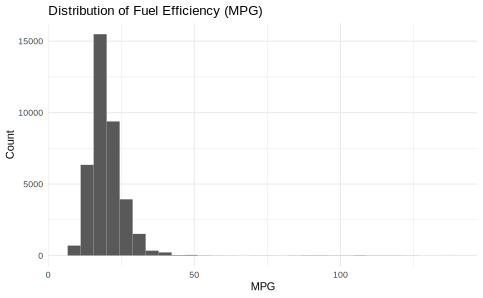
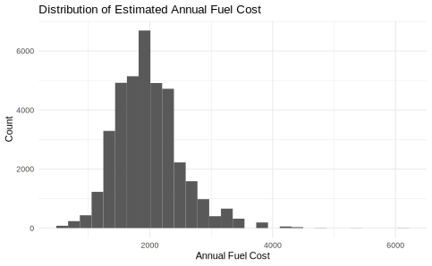
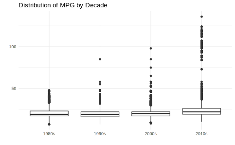
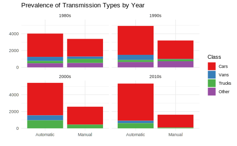

### Introduction and Data Summary

The dataset used in this exploratory analysis consists of 38113 observations of 81 features describing fuel economy data from 1984-2017 by the Environmental Protection Agency (EPA). Of the 81 features included in the dataset as provided, 8 of them contain no data at all, and several more of them contain high proportions of missing values. To avoid dealing with these incomplete features, this analysis will focus on the general attributes that are available for all records. The primary features being evaluated in this analysis are **vehicle class**, **transmission type**, **year**, **fuel efficiency (mpg)**, and **fuel cost**.

The image above represents the distribution of Fuel Efficiency in Miles Per Gallon for all vehicles included in the dataset. The highest proportion of vehicles appear to have a MPG less than 25. 

The distribution of Estimated Annual Fuel cost is presented above. According to the  [kaggle.com](https://www.kaggle.com/epa/fuel-economy) description of this dataset, Annual Fuel Cost is estimated based on a few assumptions. It is assumed that for 15,000 miles of driving per year, 55% and 45% of that driving is done on city roads and highway roads respectively. Additionally, it is assumed that fuel cost maintain the following price structure:

- $2.33/gallon for regular gasoline
- $2.58/gallon for mid-grade gasoline
- $2.82/gallon for premium gasoline

### Methods

This dataset uses many categories in its transmission and class features. To make visualizations more effective, the categories were combined as much as possible to reduce the total number of unique categories. For example, dozens of `transmission` categories were condensed to just **Automatic** or **Manual**, and dozens of vehicle `class` categories were condensed to just **"Car"**, **"Truck"**, **"Van"**, or **"Other"**. This allows visualizations to describe how vehicle class and transmission interact with other attributes without overloading the viewer with information. 

### Visualizations

Originally, the visualizations planned for this analysis were the following: 

- Average Highway / City Fuel Efficiency By Year (Boxplot)
- Prevalence of Manual/ Automatic Transmissions by Year Per Class (Barplot)
- Average Annual Fuel Cost by Year Per Class (Scatterplot)

While preparing the data and code for creating these visualizations, a few problems were identified as mentioned previously. First, presenting this data by `year` is a bit cumbersome because the dataset consists of a range of 33 years. This is fine for examining continuous variables such as Fuel Cost or Fuel Efficiency, but 33 years is too many to split when examining categorical variables. The solution for this was to create a new categorical attribute `year_group` which categorizes years into decades (80s, 90s, 2000s, 2010s). A similar issue was identified with the `transmission` and `class` categories, because the features as provided by the dataset were organized into over 30 and 40 categories respectively. This is way too many categories to fit cleanly into visualizations as described above, so those features were condensed into smaller categories. Additionally, some vehicle class categories were removed entirely due to the author's inability to reassign to an appropriate category. 

#### Visualization 1: Fuel Efficiency By Class Per Year

Image 03 shows how the distribution of fuel efficiency has changed over the last few decades. It appears that the median and IQR of fuel efficiency values have stayed relatively consistent over the years, but increasingly higher amounts of outlier values are found in more recent decades. Intuitively, this could be due to the increase of electric and other environmentally friendly vehicles being introduced into the market over the last 20 years. 

#### Visualization 2: Annual Fuel Cost By Class By Year

Image 04 plots the distribution of estimated annual fuel costs over time split by vehicle category. For this visualization, the original `year` feature was used instead of the new `year_group` so that we can see year by year trends. For all three vehicle categories shown, fuel cost appears to be relatively consistent over time. Notably, the "cars" category has the widest range of values due to it being the largest and most varied category. This visualization could be improved by further examining the vehicle categories, and possibly dividing them into a more evenly distributed set of categories. 

#### Visualization 3: Prevalence of Transmission Type by Class By Year

The final visualization created plots the total prevalence of vehicle transmission types, separated by decade and colored by `class`. In all four decades, cars with automatic transmission appear to be the most prevalent group. Additionally, the gap between manual and automatic prevalence appears to be getting wider with each decade.

### Summary

The primary goal of this Mini Project is to practice some of the principles of data visualization and design that we have learned over the past several weeks. As the above visualizations were being prepared, attention was given to important aspects such as use of chart type, color, and avoiding information overload. From the very beginning of the analysis, steps were taken to prevent the visualizations from being too busy by condensing categories and splitting `year` into decades. Additionally, the color palette was specifically chosen to distinguish the vehicle categories, but color was not used in places that wouldn't provide information to the reader. Finally, all titles and axis labels were specifically written (or excluded) in an effort to maximize information to the reader without sacrificing minimalism. 

