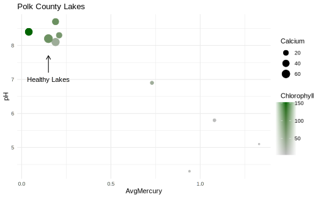

# Introduction and Data Summary

  This report is an analysis of three datasets which have been selected for practicing and demonstrating some methods of Data Visualization. The first dataset used in this analysis is a compilation of housing prices from West Roxbury which includes supporting features such as number of rooms, number of floors, total square footage, and several other similar attributes. Using multiple linear regression, a model predicting the total value of a house is fit to the dataset and the resulting coefficients and their estimates are presented. 
  The second set of data consists of two datasets pertaining to lakes in Florida. One dataset contains the mapping schemas of all Florida lakes while the other dataset contains measures of water quality for a subset of Florida lakes. Using these datasets, the water quality parameters of several Polk County lakes are visualized. 
  
# Methods

## West Roxbury Housing Prices

  The West Roxbury housing price dataset contains 14 total attributes covering many core features of homes such as number of rooms, bedrooms, kitchens, floors, and some others. Before regression is performed, some data pre-processing is performed such as converting many of the categorical variables to factors and adjusting some of the names of variables to better fit R's syntax. An initial model is fit using all of the available variables. This initial model suggests that the number of rooms and bedrooms may not be as significant as the other included features in the model, so those two variables were removed and a second model was fit. In this second model, almost all variables appear significant except for some of the highest factor levels. For example having one, two, or three fireplaces has a significant influence on total price, but having a fourth fireplace seems to be insignificant. The same pattern appears in the case of having a third floor or a third half bathroom. 
  
## Florida Lakes 

  The Florida Lakes dataset contains several measures of water quality pertaining to lakes such as pH, alkalinity, calcium, chlorophyll, and others. These features can all be examined to evaluate the general health of a lake. The other Florida Lakes dataset contains the shapefiles of the lakes including features such as total area, perimeter, and the residing county. 
  A challenge that came up while working with these datasets was matching the lakes from the dataset to the lakes from the shapefiles. The only variable that could be as a key for joining was the name of the lake, where both datasets used a slightly different naming convention. Additionally, only the shapefile lakes included which county the lakes were from, and there are many lakes that share the same name but reside in different counties. In this case, the author elected to focus only on Polk County lakes, and simply try to match the names. 

# Visualizations

## West Roxbury


Each of the coefficients of the final model fit are presented here along with their associated metrics. Coefficients with a p-value less than 0.05 are considered to be significant. 


This visualization presents each of the coefficients along with their estimates. Estimates that appear on the left of the 'zero' line represent having a negative effect on house prices, while estimates appearing on the right represent having an increasing effect on house prices. 


## Polk County Lakes



Polk County Lakes are presented above visualizing average Mercury, pH, chlorophyll, and calcium. Lakes with a pH between ~8 and 9 appear to have less mercury and more chlorophyll present than lakes with lower pH. 

```{r echo=, message=FALSE, warning=FALSE}
library(plotly)
load("PolkLakes.rda")
p
```

The polk county lakes that had water quality data available are presented above. Lake Parker, being the largest lake here, appears to have a lot more algae present than in the other presented lakes. 

# Conclusions

Both of the datasets used here make for great demonstrations of visualizing multiple linear regression, interactive plots, and spatial visualizations. Other ideas that were considered include performing multiple linear regression on the lakes dataset to fit a model predicting chlorophyll, but this was left out in favor of performing regression on the housing dataset. Future iterations of this work should consider revisiting the join performed on the lake datasets, as it is likely that an error occurred resulting in the possibility of attributes being matched to a lake that shared the same name, but may not actually be from that county. If another dataset was found that included water quality metrics and the associated county where the lake is from, a more accurate analysis could be performed. 


